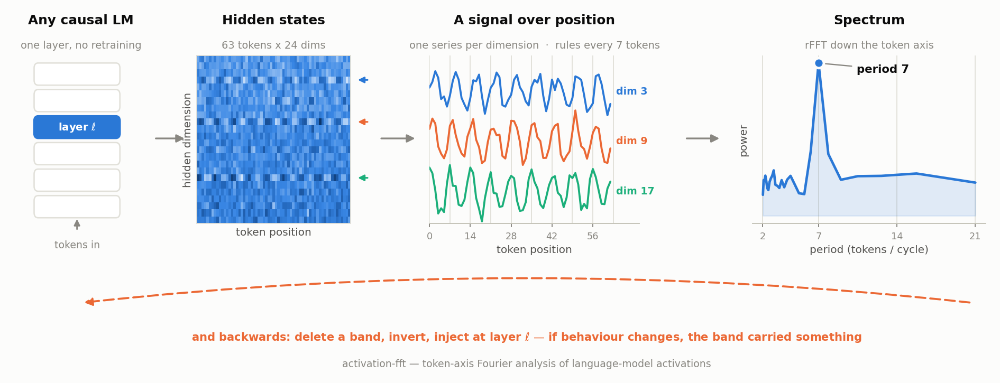

# activation-fft

**A spectrum view of a language model's hidden layers.**

Point it at any layer of any causal LM and ask a question the usual tools
cannot: *what repeats in here, and how often?* The answer comes back in tokens.



## The idea

A layer's hidden state is a matrix — one row per token, one column per
dimension. Read a single column top to bottom and you have a signal sampled
once per token. Fourier-transform it, and every peak is a periodicity whose
length you can check against the text. A peak at 7 means that dimension repeats
every seven tokens.

Two things follow from that.

**A lens.** Spectra are comparable across layers, inputs and models. You can
watch structure appear with depth, or vanish between one prompt and the next.

**A probe.** The transform is invertible, so it also runs backwards in the
middle of a forward pass: delete a frequency band, transform back, inject at the
same layer, and let the rest of the network finish. If behaviour changes, the
band was carrying something the model used. If nothing changes, it wasn't.

Nothing is trained, nothing is fine-tuned, and the model is used exactly as
shipped. The figure above is not an illustration — it is this package running on
a synthetic signal with a period of 7 planted in three of its dimensions, and
the peak it recovers is the one it found.

## Install

```bash
pip install -e ".[plot]"
```

Python 3.9–3.13 (torch has no 3.14 build).

## Quick start

```python
import activation_fft as af

lm = af.load_model("Qwen/Qwen3-1.7B")          # Hub id or a path on disk
acts = af.hidden_states(lm, text, layers=[20])[0][20]
spec = af.token_spectrum(acts.values, layer=20)
print(spec.peak())                              # (period, frequency, power)
```

To intervene:

```python
from activation_fft import SpectralEdit, spectral_edit

edit = SpectralEdit(op="bandstop", low_cutoff=0.0, high_cutoff=0.1)
with spectral_edit(lm.model, layer=20, edit=edit):
    out = lm.model(**inputs)      # runs with that band removed
```

Ops: `lowpass`, `highpass`, `bandstop`, `band_attenuate`, `band_noise`,
broadband `noise`, `act_zero` and `act_noise` as activation-domain controls,
and `none` for the round trip alone.

## Design Notes

**Units.** Cycles per token, 0 to 0.5. Nyquist at 0.5 puts the shortest
resolvable period at 2 tokens. Plots default to the reciprocal, tokens per
cycle, because that is what you can check against the text.

**Resolution.** Bin spacing is `1/n_tokens`, so two periods separate only when
`n_tokens > 1/|1/p₁ − 1/p₂|`. Telling 5 from 7 needs 18 tokens;
`min_tokens_to_separate` computes it. This is also why a true period-7 signal
peaks at 7.20 in a 72-token window — the nearest bins are 6.55 and 7.20.

**Only real tokens.** Padded positions carry hidden states, and a near-constant
tail loads the low bins. `token_spectrum(..., n_tokens=n)` truncates first;
`SpectralEdit` takes the same argument. Position usually survives padding,
prominence does not: ~200 to ~650 peak-to-median on the reference case.

**Detrend and window.** Removing each dimension's mean kills DC leakage; a Hann
window stops the first-to-last discontinuity spreading energy, at about one and
a half bins of peak width. So an edit and an analysis using different windows
will not agree — a band zeroed exactly reads `1.7e-14` under a boxcar and
`3.7e-2` under Hann.

**Rescale dimensions before averaging.** They differ in scale by orders of
magnitude, so a raw average is whatever the loudest few are doing.
`normalize_dims=True` divides each by its own standard deviation. Turn it off
when absolute power is the point.

**Depth is cheap.** One forward pass returns every layer, so a sweep costs no
more than a single layer. Layer 0 is the first block's output, negatives count
from the end. The embedding output is not addressable — its spectrum belongs to
the token sequence, not the model.

**The round trip is not free.** rFFT then irFFT is not exactly the identity in
floating point, and cuFFT forces float32 at non-power-of-two lengths. Measure
against a run with `op="none"`, not against the untouched model.

**Band comparisons need matched energy.** Spectra fall off steeply, so the
bottom bins hold most of the energy. An equal-width `bandstop` at 0.0–0.1
removes 99.8% of a hidden state's energy; at 0.4–0.5, 0.004%. A factor of
25,000, so the low band "wins" any comparison regardless of what it encodes —
at the limit, delete DC and nothing is left to classify.
`equal_power_split(spectrum, fraction)` picks cutoffs holding equal power and
reports how much wider the high band had to be. `match_noise_std` does the
equivalent for noise-type edits, whose energy grows with the square of the
level. Deleting a band has a fixed cost no noise level can tune.

**What this does not do.** It does not show a peak is causal; the intervention
half does that, and only for the layer and band you edited. It does not average
spectra of different lengths, since a bin index would mean different
frequencies — `average_spectra` refuses. It does not do significance testing:
compare against shuffled tokens or random weights yourself.

## Layout

```
activation_fft/
  extract.py    load a model, pull hidden states, count tokens
  spectrum.py   the transform and the Spectrum type
  perturb.py    spectral edits and the forward hook
  energy.py     equal-power bands, energy-matched noise
  plot.py       spectrum, layer sweep, band split
  cli.py        python -m activation_fft
examples/       two worked studies — see examples/README.md
```

## License

MIT.
