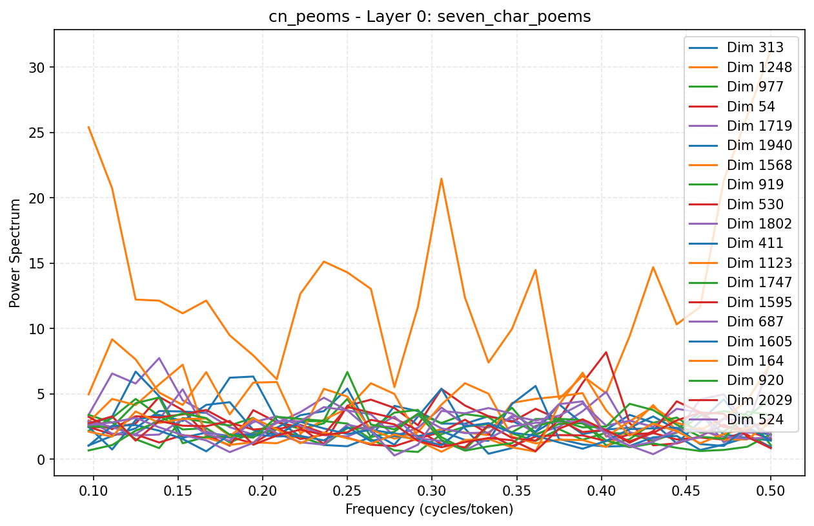
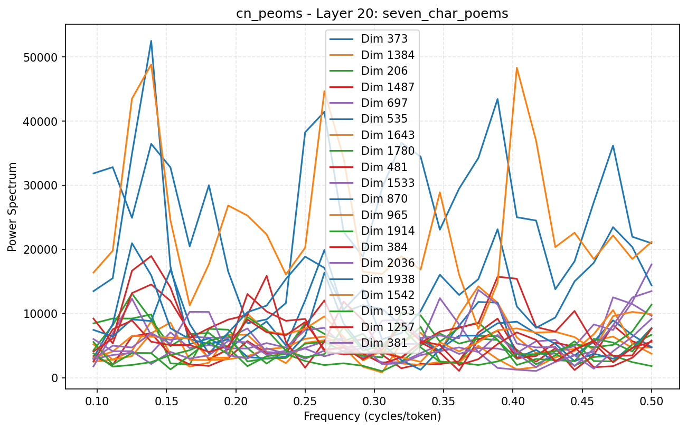
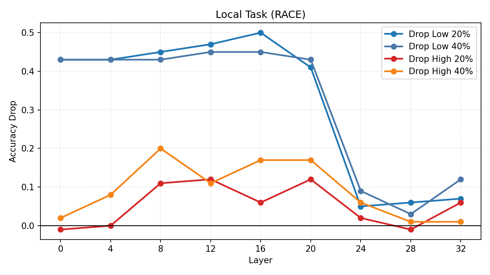
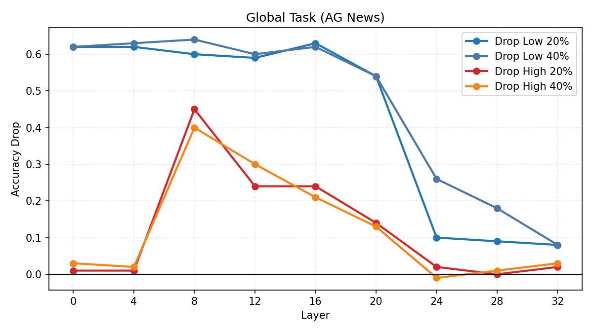

# Results

<<<<<<< HEAD
This folder contains a short summary of the main results together with a few representative figures.
=======
This folder keeps only the public-facing output of the project: a short summary and a few selected figures.
>>>>>>> 22216ed345cc05dfa9b66897e4e6896da6857841

## Completed Experiments

### 1. Frequency analysis of internal activations

The main pipeline extracts hidden activations from a chosen layer, applies DFT or rFFT along the token axis, and studies layer-wise spectral structure.

The Chinese poem experiment is kept here as a compact visual example. Two representative layers are shown below:

- `poem_spectrum_layer_0.png`: an early-layer spectrum snapshot
- `poem_spectrum_layer_20.png`: a deeper-layer spectrum snapshot

<<<<<<< HEAD
The key result is stronger than a generic spectral-shape observation: the dominant spectral periods align exactly with Chinese line length. In five-character poems the major peak appears at period 5, and in seven-character poems the major peak appears at period 7. This is a direct correspondence between spectral peak period and the number of characters per poetic line.
=======
These plots show that spectral energy is not distributed uniformly across frequencies, and that the shape changes substantially with depth.
>>>>>>> 22216ed345cc05dfa9b66897e4e6896da6857841

### 2. Locality experiments under spectral editing

The locality experiments compare the effect of removing low-frequency bands versus high-frequency bands on local and global tasks.

- `locality_local_task_curve.png`: the local-task accuracy-drop curve
- `locality_global_task_curve.png`: the global-task accuracy-drop curve

<<<<<<< HEAD
The qualitative pattern is consistent across the retained results:

- for detail-oriented tasks, high-frequency interference causes larger degradation
- for global tasks, low-frequency interference causes larger degradation

Together with the poem experiment, this suggests that the spectral representation tracks both explicit surface rhythm and functionally meaningful locality structure.

### 3. Relation between the two experiments

The poem experiment and the locality experiment support the same broader interpretation from two different angles.

- The poem experiment shows that spectral peak period can match a concrete linguistic rhythm exactly, namely 5 and 7 characters per line.
- The locality experiment shows that different frequency bands contribute differently to different task types: high frequency matters more for detail, while low frequency matters more for global structure.
=======
The retained figures show a clear difference between low-band removal and high-band removal, and that the effect is strongly layer-dependent.

### 3. Archived agreement-style comparisons

Agreement-style comparisons were also run during the project, but the large raw result archives have been removed from this public folder. Only the main conclusion is retained here: frequency-domain edits can be compared directly against activation-domain edits, and the resulting layer-wise trends are not identical.
>>>>>>> 22216ed345cc05dfa9b66897e4e6896da6857841

## Selected Figures

### Early-layer poem spectrum

### Deep-layer poem spectrum

### Local-task locality curve

### Global-task locality curve

